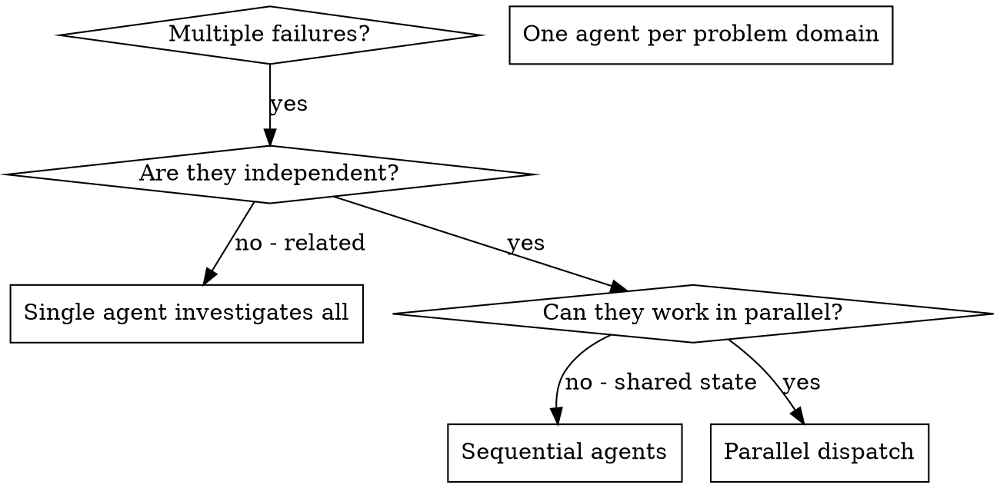

# Dispatching Parallel Agents

## Overview

You delegate tasks to specialized agents with isolated context. By precisely crafting their instructions and context, you ensure they stay focused and succeed at their task. They should never inherit your session's context or history — you construct exactly what they need. This also preserves your own context for coordination work.

When you have multiple unrelated failures (different test files, different subsystems, different bugs), investigating them sequentially wastes time. Each investigation is independent and can happen in parallel.

**Core principle:** Dispatch one agent per independent problem domain. Let them work concurrently.

## When to Use



**Use when:**
- 3+ test files failing with different root causes
- Multiple subsystems broken independently
- Each problem can be understood without context from others
- No shared state between investigations

**Don't use when:**
- Failures are related (fix one might fix others)
- Need to understand full system state
- Agents would interfere with each other

## The Pattern

### 1. Identify Independent Domains

Group failures by what's broken:
- File A tests: Tool approval flow
- File B tests: Batch completion behavior
- File C tests: Abort functionality

Each domain is independent - fixing tool approval doesn't affect abort tests.

### 2. Create Focused Agent Tasks

Each agent gets:
- **Specific scope:** One test file or subsystem
- **Clear goal:** Make these tests pass
- **Constraints:** Don't change other code
- **Expected output:** Summary of what you found and fixed

### 3. Dispatch in Parallel

```typescript
// In Claude Code / AI environment
Task("Fix agent-tool-abort.test.ts failures")
Task("Fix batch-completion-behavior.test.ts failures")
Task("Fix tool-approval-race-conditions.test.ts failures")
// All three run concurrently
```

### 4. Review and Integrate

When agents return:
- Read each summary
- Verify fixes don't conflict
- Run full test suite
- Integrate all changes

**Do not re-summarize a summary.** The dominant failure of this step is the
telephone game: the dispatcher paraphrases what each agent reported, loses the
detail that mattered, and reports its own paraphrase upward. Measured on
supervisor architectures, this costs roughly half the achievable quality — not a
rounding error, the single largest loss in the pattern.

Two rules prevent it:

- **Forward, don't retell.** When an agent's result is already final and complete,
  pass it through verbatim rather than restating it. Reserve your own words for
  synthesis across agents — the part no single agent could write.
- **Constrain the return so there is nothing to paraphrase.** An agent that
  returns a verdict, a severity, and one sentence gives you nothing to garble. An
  agent that returns three paragraphs guarantees you will compress them, badly.
  Full reasoning goes to a file; the return carries the decision and the path.

**Validate before consuming, not after integrating.** One agent's wrong
conclusion becomes the next step's premise, and downstream there is no way to
tell an upstream hallucination from a fact. Check each result against something
outside the agent that produced it — the diff, the test run, the file — before
any of it feeds the next decision.

## Agent Prompt Structure

Good agent prompts are:
1. **Focused** - One clear problem domain
2. **Self-contained** - All context needed to understand the problem
3. **Specific about output** - What should the agent return?

```markdown
Fix the 3 failing tests in src/agents/agent-tool-abort.test.ts:

1. "should abort tool with partial output capture" - expects 'interrupted at' in message
2. "should handle mixed completed and aborted tools" - fast tool aborted instead of completed
3. "should properly track pendingToolCount" - expects 3 results but gets 0

These are timing/race condition issues. Your task:

1. Read the test file and understand what each test verifies
2. Identify root cause - timing issues or actual bugs?
3. Fix by:
   - Replacing arbitrary timeouts with event-based waiting
   - Fixing bugs in abort implementation if found
   - Adjusting test expectations if testing changed behavior

Do NOT just increase timeouts - find the real issue.

Return: Summary of what you found and what you fixed.
```

## Common Mistakes

**❌ Too broad:** "Fix all the tests" - agent gets lost
**✅ Specific:** "Fix agent-tool-abort.test.ts" - focused scope

**❌ No context:** "Fix the race condition" - agent doesn't know where
**✅ Context:** Paste the error messages and test names

**❌ No constraints:** Agent might refactor everything
**✅ Constraints:** "Do NOT change production code" or "Fix tests only"

**❌ Vague output:** "Fix it" - you don't know what changed
**✅ Specific:** "Return summary of root cause and changes"

## On Claude Opus 5, the default already leans toward dispatching

This skill was written to encourage fan-out. On Opus 5 the model's own bias runs
the same direction, so the skill and the model now push the same way and nothing
pushes back. Anthropic's Opus 5 prompting guide:

> Claude Opus 5 delegates to subagents more readily than prior models. Delegation
> pays off on genuinely independent, sizeable tracks of work, but it multiplies
> cost and time when applied to small tasks.

Its recommended instruction, which belongs in the harness rather than in your head:

> Delegate to a subagent only for large tasks that are genuinely independent and
> parallelizable, such as a wide multi-file investigation. Do not delegate work
> you can finish yourself in a handful of tool calls, and do not use subagents to
> verify or double-check your own work. If one subagent can complete the task, use
> one rather than several, and keep spawn counts low.

Two of those clauses contradict habits this file otherwise encourages, so read
them as amendments:

- **"Work you can finish in a handful of tool calls" is not a fan-out candidate**,
  even when the tasks are genuinely independent. Independence is what makes
  dispatch *possible*; size is what makes it *worth it*. The three-test-file
  example below is close to the line, not comfortably past it.
- **Never spawn an agent to verify your own finished work.** The guide names this
  specifically, and Opus 5 self-corrects well enough that the second pass mostly
  buys a second opinion at full price. A subagent asked to *refute one named
  claim* with fresh context is a different construct — but if you find yourself
  handing over a finished result for a general review, that is the pattern being
  warned about.

**Prefer deterministic caps to self-restraint.** Under Claude Code or the Agent
SDK the limits are `CLAUDE_CODE_MAX_SUBAGENT_SPAWN_DEPTH`,
`CLAUDE_CODE_MAX_CONCURRENT_SUBAGENTS`, and the SDK's `max_budget_usd` (Claude
Code 2.1.217+). A cap that the harness enforces survives the 3am judgement call
that a soft rule does not. Note also that Claude Code only injects its own
delegation instruction when using the `claude_code` system prompt preset — with a
custom or omitted system prompt, the instruction above is yours to add.

## When NOT to Use

**Related failures:** Fixing one might fix others - investigate together first
**Need full context:** Understanding requires seeing entire system
**Exploratory debugging:** You don't know what's broken yet
**Shared state:** Agents would interfere (editing same files, using same resources)

## Real Example from Session

**Scenario:** 6 test failures across 3 files after major refactoring

**Failures:**
- agent-tool-abort.test.ts: 3 failures (timing issues)
- batch-completion-behavior.test.ts: 2 failures (tools not executing)
- tool-approval-race-conditions.test.ts: 1 failure (execution count = 0)

**Decision:** Independent domains - abort logic separate from batch completion separate from race conditions

**Dispatch:**
```
Agent 1 → Fix agent-tool-abort.test.ts
Agent 2 → Fix batch-completion-behavior.test.ts
Agent 3 → Fix tool-approval-race-conditions.test.ts
```

**Results:**
- Agent 1: Replaced timeouts with event-based waiting
- Agent 2: Fixed event structure bug (threadId in wrong place)
- Agent 3: Added wait for async tool execution to complete

**Integration:** All fixes independent, no conflicts, full suite green

**Time saved:** 3 problems solved in parallel vs sequentially

**What this example does not show:** nobody ran the same six failures through one
agent, so "time saved" here is an estimate against an unmeasured baseline. Wall
clock fell; total tokens almost certainly rose. Both numbers are worth having
before citing a session like this as evidence that fan-out was the right call.

## Key Benefits

1. **Parallelization** - Multiple investigations happen simultaneously
2. **Focus** - Each agent has narrow scope, less context to track
3. **Independence** - Agents don't interfere with each other
4. **Speed** - 3 problems solved in time of 1

## What it costs — price this before dispatching

The benefits above are real and they are not free. A fan-out runs on the order of
**15x the tokens** of the single-agent baseline it replaces: every agent carries
its own system prompt and tool definitions, and the dispatcher pays again for
instructions, returns, retries, and integration. Teams underbudget this
consistently, because they estimate per-agent cost and forget the coordination.

So the decision is not "are these tasks independent" — that is necessary, not
sufficient. It is **"would one careful pass have done this"**. Price that pass
first. A fan-out that never beat it is not a win, it is a bill.

**The real reason to fan out is context isolation, not role-play.** Agents are
worth their cost when a single context genuinely cannot hold the problem without
degrading — not because "a testing agent and a security agent" sounds like a
team. If all the work fits in one window with attention to spare, one pass wins.

Three limits that follow:

- **Cap a single fan-out at 3–5 workers.** Past that the dispatcher spends more
  tokens reading summaries than the workers spend working, and each additional
  agent adds communication paths faster than it adds coverage. If you need more,
  add a tier rather than widening one.
- **Do not over-decompose.** A ten-step pipeline with ten agents spends more on
  handoffs than on work. Split only where a subtask genuinely benefits from its
  own context.
- **Prefer a shared file over message-passing for shared state.** State that
  several agents must read faithfully degrades every time it is retold. Put it in
  a file and pass the path.

## Verification

After agents return:
1. **Review each summary** - Understand what changed
2. **Check for conflicts** - Did agents edit same code?
3. **Run full suite** - Verify all fixes work together
4. **Spot check** - Agents can make systematic errors

## Real-World Impact

From debugging session (2025-10-03):
- 6 failures across 3 files
- 3 agents dispatched in parallel
- All investigations completed concurrently
- All fixes integrated successfully
- Zero conflicts between agent changes

<!--
Copied from poseidon-http-client @ main on 2026-08-16, then extended the same day.

DIVERGED FROM THE CLIENT REPO. Additions, not upstream text:
  - "Do not re-summarize a summary" / "Validate before consuming" (in step 4)
  - "What it costs — price this before dispatching"
  - the baseline caveat under Real Example
Source: the `context-engineering:multi-agent-patterns` skill. Upstream listed
only the benefits of fan-out; the telephone game and the ~15x token multiplier
are the two facts that decide whether it was worth doing.
-->

<!--
Second pass, 2026-08-16: reconciled against Anthropic's "Prompting Claude Opus 5"
guide (platform.claude.com/docs/en/build-with-claude/prompt-engineering/prompting-claude-opus-5).
The section naming Opus 5 explicitly is from that pass.
-->
